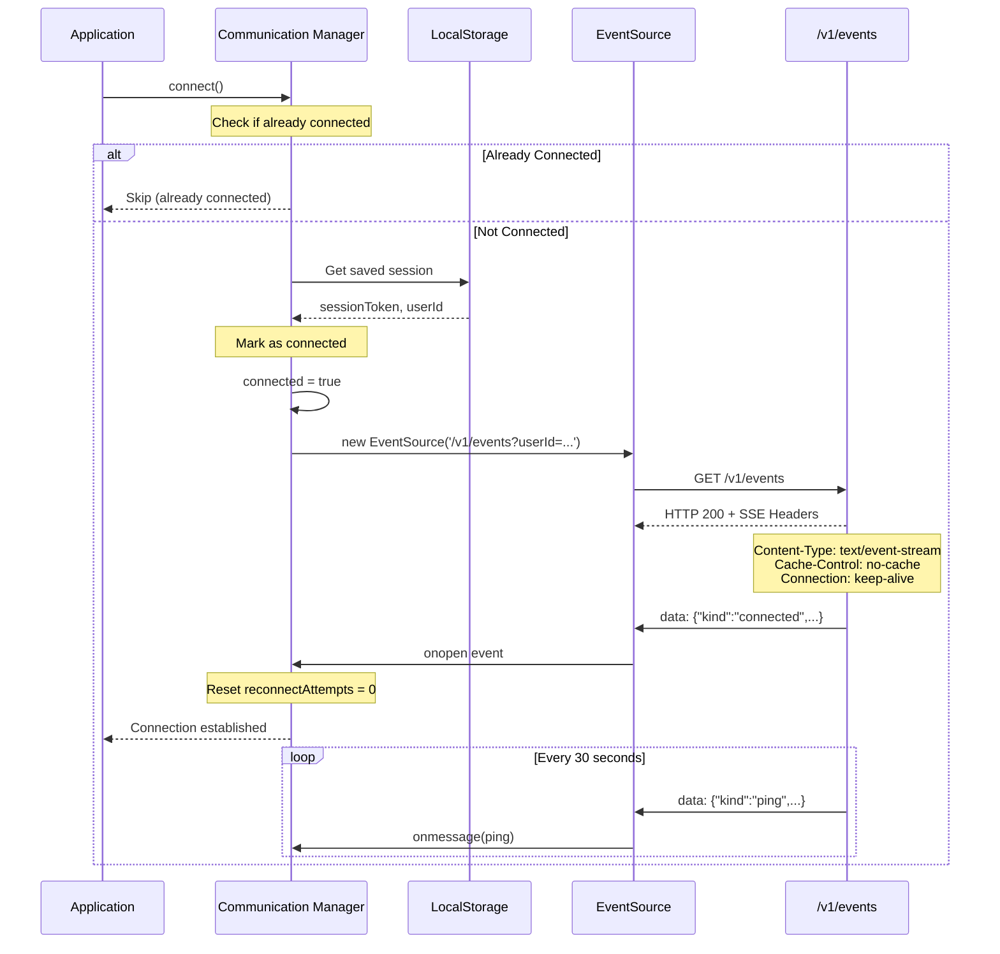
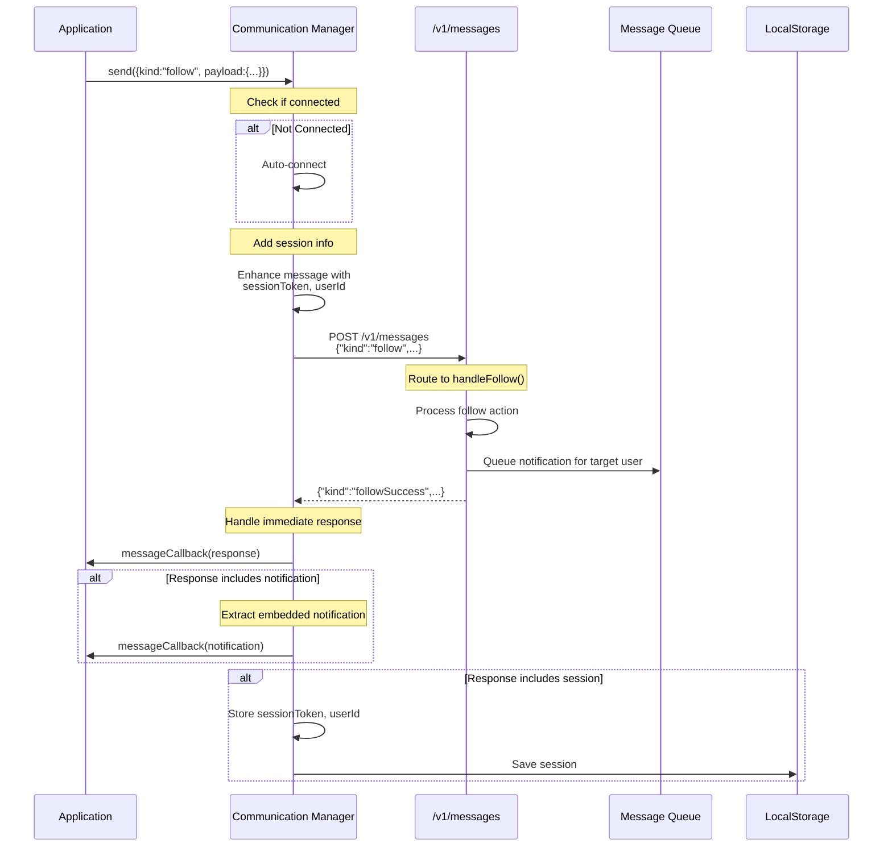
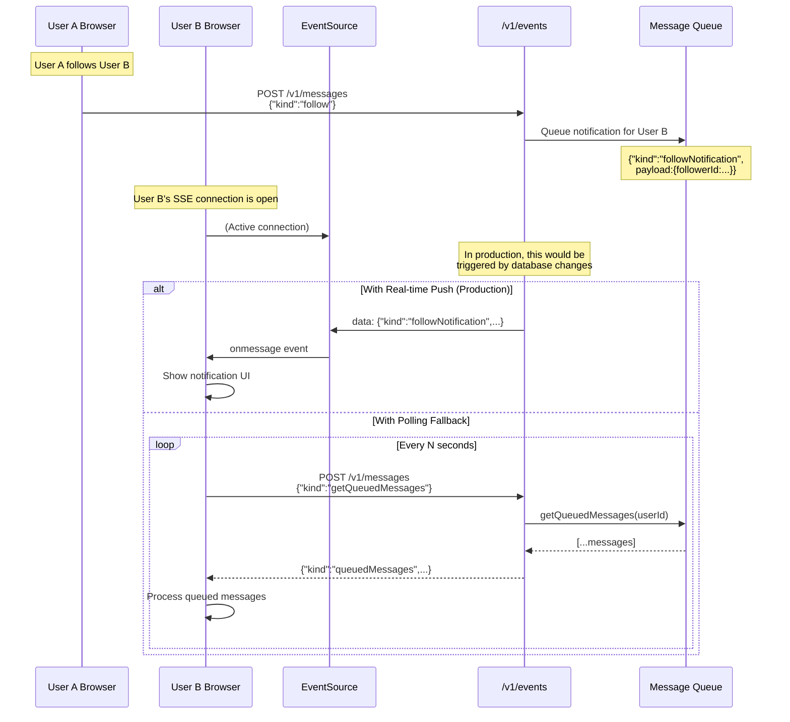
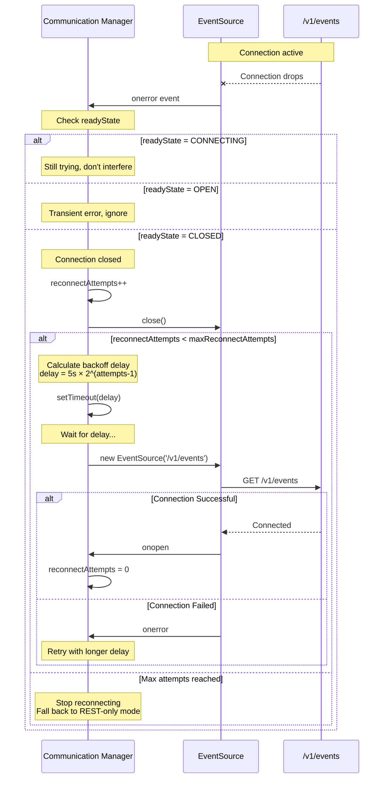
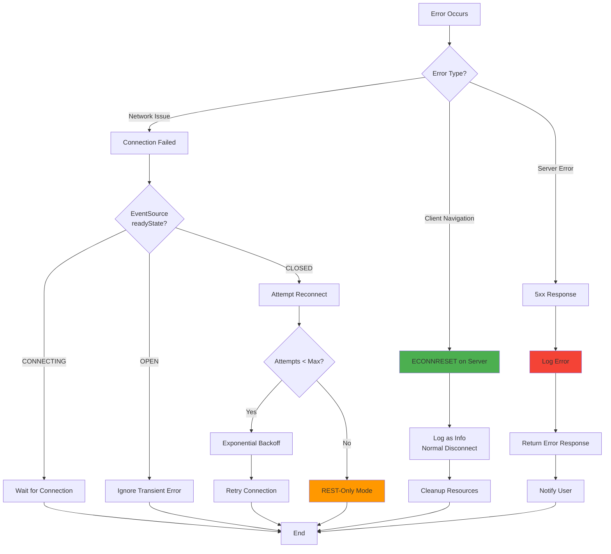
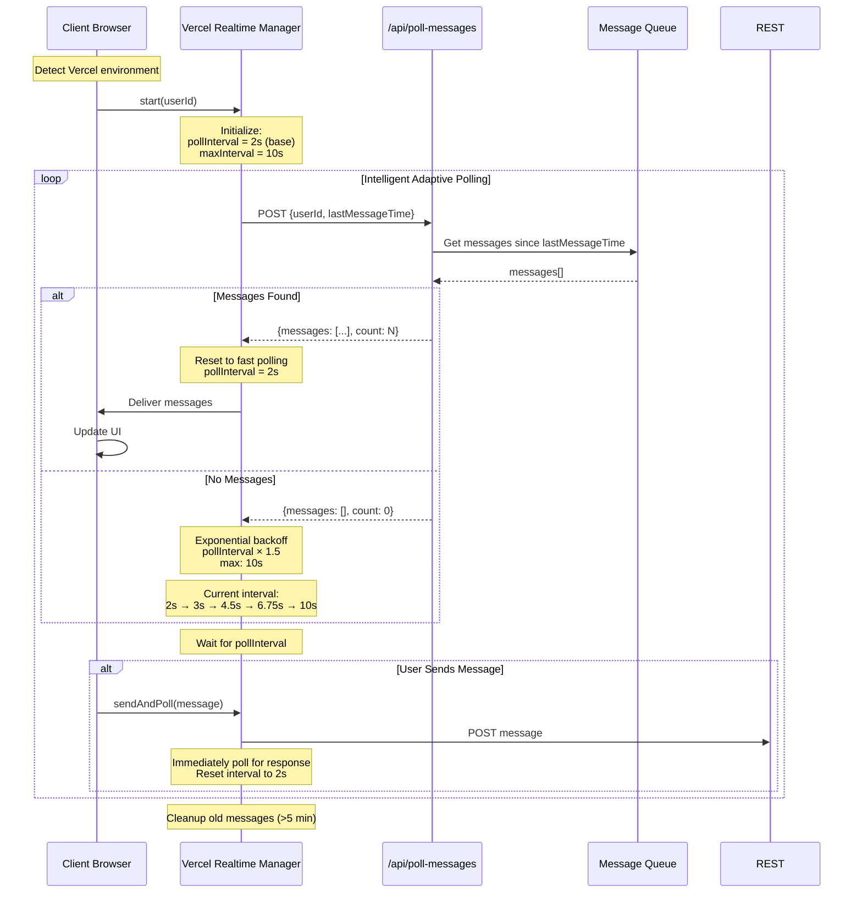
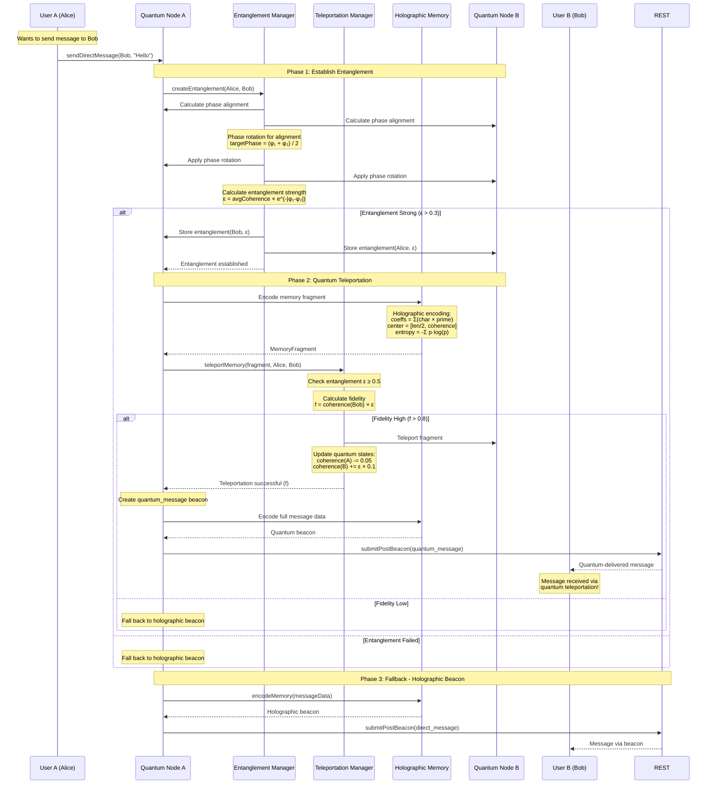
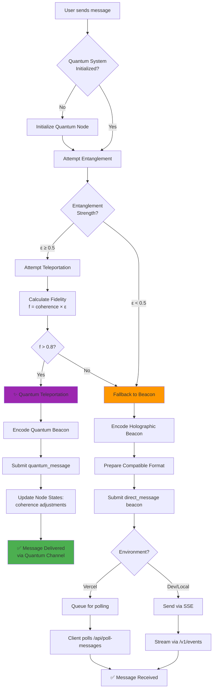

# Communication Architecture - Summoned Spaces

## Overview

Summoned Spaces implements a sophisticated multi-layered communication architecture that combines traditional client-server patterns with cutting-edge quantum networking and holographic memory encoding for true peer-to-peer, non-local communication.

## Complete Communication Stack

```mermaid
graph TB
    subgraph "Layer 4: Application"
        APP[Application Components]
        MSG[Messaging Service]
    end
    
    subgraph "Layer 3: Quantum Network"
        QNO[Quantum Network Ops]
        ENT[Entanglement Manager]
        TEL[Teleportation Manager]
        HMM[Holographic Memory Manager]
    end
    
    subgraph "Layer 2: Transport"
        CM[Communication Manager<br/>SSE + REST]
        VRM[Vercel Realtime Manager<br/>Intelligent Polling]
    end
    
    subgraph "Layer 1: Server"
        SSE[/v1/events<br/>SSE Endpoint]
        REST[/v1/messages<br/>REST Endpoint]
        POLL[/api/poll-messages<br/>Polling Endpoint]
    end
    
    APP -->|Send Message| MSG
    MSG -->|Try Quantum First| QNO
    QNO -->|Fallback| CM
    
    QNO --> ENT
    QNO --> TEL
    QNO --> HMM
    
    CM --> SSE
    CM --> REST
    VRM --> POLL
    
    style QNO fill:#9C27B0
    style TEL fill:#E91E63
    style HMM fill:#FF5722
```

## Layer 1: Traditional Client-Server Communication

### Connection Initialization Flow



### Message Sending Flow (Client to Server)



### Real-Time Update Flow (Server to Client)



### Reconnection Flow



### Error Handling Flow



## Layer 2: Intelligent Polling System (Vercel Environment)

For Vercel deployments (which have SSE timeout limits), the system implements adaptive polling:



## Layer 3: Quantum Network Communication

### Quantum Teleportation Flow

The system implements true quantum teleportation for message delivery:



### Holographic Memory Encoding

Messages are encoded as prime-indexed holographic beacons:

```mermaid
flowchart TB
    Start[Message: "Hello Bob"] --> Encode[Holographic Memory Encoder]
    
    Encode --> Step1[Convert to character codes]
    Step1 --> Step2[Map to prime indices]
    Step2 --> Step3[Calculate coefficients]
    Step3 --> Step4[Compute holographic center]
    Step4 --> Step5[Calculate entropy]
    Step5 --> Step6[Generate fingerprint]
    Step6 --> Step7[Create signature]
    
    Step7 --> Beacon[Holographic Beacon]
    
    Beacon --> Fields{Beacon Fields}
    
    Fields --> F1[fingerprint: Uint8Array<br/>quantum signature]
    Fields --> F2[signature: Uint8Array<br/>cryptographic proof]
    Fields --> F3[index: prime indices<br/>spatial encoding]
    Fields --> F4[epoch: timestamp]
    Fields --> F5[coeffs: amplitude map<br/>holographic data]
    Fields --> F6[center: x, y<br/>quantum center]
    Fields --> F7[entropy: H<br/>information measure]
    
    F1 --> Serialize[Serialize for Transport]
    F2 --> Serialize
    F3 --> Serialize
    F4 --> Serialize
    F5 --> Serialize
    F6 --> Serialize
    F7 --> Serialize
    
    Serialize --> Compatible{Make Decoder<br/>Compatible}
    
    Compatible --> C1[fingerprint → Array]
    Compatible --> C2[signature → Array]
    Compatible --> C3[index → prime_indices JSON]
    Compatible --> C4[Add originalText fallback]
    
    C1 --> Submit[Submit to Server]
    C2 --> Submit
    C3 --> Submit
    C4 --> Submit
    
    style Encode fill:#9C27B0
    style Beacon fill:#E91E63
    style Compatible fill:#FF5722
```

### Complete Message Sending Decision Tree



## Implementation Details

### Client-Side Components

#### Communication Manager (`src/services/communication-manager.ts`)
- **Dual Communication Pattern**:
  - Uses EventSource for receiving real-time updates (server → client)
  - Uses fetch POST to `/v1/messages` for sending messages (client → server)

- **Session Management**:
  - Stores `sessionToken` and `userId` in localStorage
  - Automatically includes session info in all outgoing messages

- **Reconnection Strategy**:
  - Exponential backoff: 5s, 10s, 20s, 40s, 80s
  - Maximum 5 reconnection attempts
  - Falls back to REST-only mode after max attempts

- **Error Classification**:
  - `CONNECTING`: Initial connection in progress
  - `OPEN`: Connection active, transient errors ignored
  - `CLOSED`: Connection lost, triggers reconnection

#### Vercel Realtime Manager (`src/services/vercel-realtime-manager.ts`)
- **Intelligent Polling**:
  - Base interval: 2 seconds
  - Max interval: 10 seconds
  - Backoff multiplier: 1.5x per empty response

- **Adaptive Behavior**:
  - Resets to fast polling on message receipt
  - Immediate poll after user sends message
  - Cleanup of messages older than 5 minutes

#### Messaging Service (`src/services/messaging.ts`)
- **Quantum-First Approach**:
  1. Attempt quantum entanglement
  2. Try quantum teleportation if entangled
  3. Fall back to holographic beacon
  4. Use standard communication as last resort

- **Holographic Encoding**:
  - Prime-indexed spatial encoding
  - Quantum fingerprinting
  - Cryptographic signatures
  - Fallback originalText preservation

### Server-Side Components

#### SSE Endpoint (`api/events.ts`)
- **Server-Sent Events**:
  - Establishes long-lived HTTP connection
  - Sends `Content-Type: text/event-stream`
  - Ping every 30 seconds to keep connection alive
  - Handles `ECONNRESET` gracefully (normal during navigation)

#### REST Endpoint (`api/messages.ts`)
- **Message Processing**:
  - Processes all message types (follow, post, comment, etc.)
  - Returns immediate responses
  - Can queue notifications for SSE delivery
  - Includes embedded notifications in responses as fallback

#### Message Queue
- **In-Memory Queue**:
  - Stores notifications for users
  - Can be polled via `getQueuedMessages`
  - Cleared after retrieval
  - Would use Redis in production

### Quantum Network Components

#### Quantum Network Operations (`src/services/quantum/index.ts`)
- Coordinates all quantum operations
- Manages node lifecycle
- Integrates entanglement, teleportation, and consensus

#### Entanglement Manager (`src/services/quantum/entanglement.ts`)
- **Phase Alignment**:
  ```
  targetPhase = (φ₁ + φ₂) / 2
  ```
- **Entanglement Strength**:
  ```
  ε = avgCoherence × e^(-|φ₁-φ₂|)
  ```
- Bidirectional entanglement storage
- Coherence updates based on entanglement

#### Teleportation Manager (`src/services/quantum/teleportation.ts`)
- **Requirements**:
  - Entanglement strength ≥ 0.5
  - Fidelity > 0.8 for success
- **Fidelity Calculation**:
  ```
  f = coherence(target) × ε
  ```
- **State Updates**:
  ```
  coherence(source) -= 0.05
  coherence(target) += ε × 0.1
  ```

## Communication Flow Comparison

| Feature | Local/Dev | Vercel | Quantum Mode |
|---------|-----------|---------|--------------|
| **Outbound** | POST /v1/messages | POST /v1/messages | Quantum teleportation → beacon fallback |
| **Inbound** | SSE stream | Adaptive polling | Direct quantum state transfer |
| **Latency** | <100ms | 2-10s | Theoretically instant (if successful) |
| **Reliability** | High | Medium | High (with fallback) |
| **Privacy** | Server-mediated | Server-mediated | True P2P (quantum path) |
| **Fidelity** | 100% | 100% | 70-100% (quantum path) |

## Three-Tier Fallback Strategy

The system implements a resilient, privacy-preserving communication system:

1. **Quantum Teleportation** (instant, P2P, requires entanglement)
   - Ideal for private, real-time communication
   - Requires node coherence and entanglement
   - Fidelity-based success determination

2. **Holographic Beacon** (client-side encoded, server-stored)
   - Prime-indexed spatial encoding
   - Quantum fingerprinting for verification
   - Fallback text preservation

3. **Standard REST/SSE** (traditional client-server)
   - Reliable fallback for all scenarios
   - Environment-adaptive (SSE vs polling)
   - Exponential backoff reconnection

## Production Considerations

### Current Limitations
- In-memory message queue (needs Redis)
- No persistent storage (needs Neon database)
- Vercel function timeouts for SSE
- Mock quantum operations (conceptual proof)

### Production Ready Path
1. **Redis** for message queue and real-time coordination
2. **Neon Database** for persistent data storage
3. **WebSocket Alternative** for longer connections on dedicated servers
4. **Quantum Backend** for actual quantum entanglement operations
5. **Distributed Consensus** for multi-region deployments

## File References

- Communication Manager: `src/services/communication-manager.ts`
- Vercel Realtime Manager: `src/services/vercel-realtime-manager.ts`
- Messaging Service: `src/services/messaging.ts`
- Quantum Network Ops: `src/services/quantum/index.ts`
- Entanglement Manager: `src/services/quantum/entanglement.ts`
- Teleportation Manager: `src/services/quantum/teleportation.ts`
- SSE Endpoint: `api/events.ts`
- REST Endpoint: `api/messages.ts`
- Poll Endpoint: `api/poll-messages.ts`

---

**Last Updated**: 2025-10-05  
**Version**: 1.0  
**Status**: Active Development