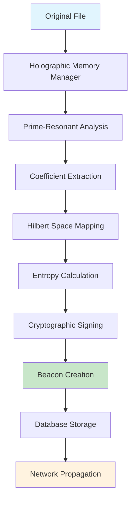
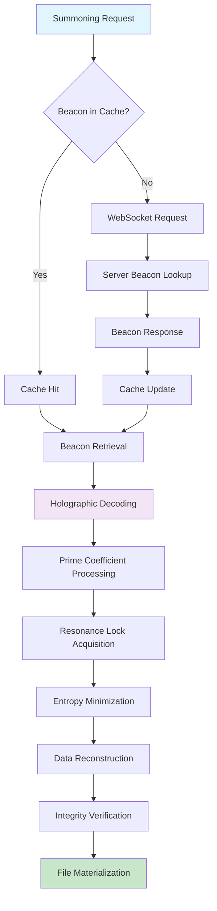
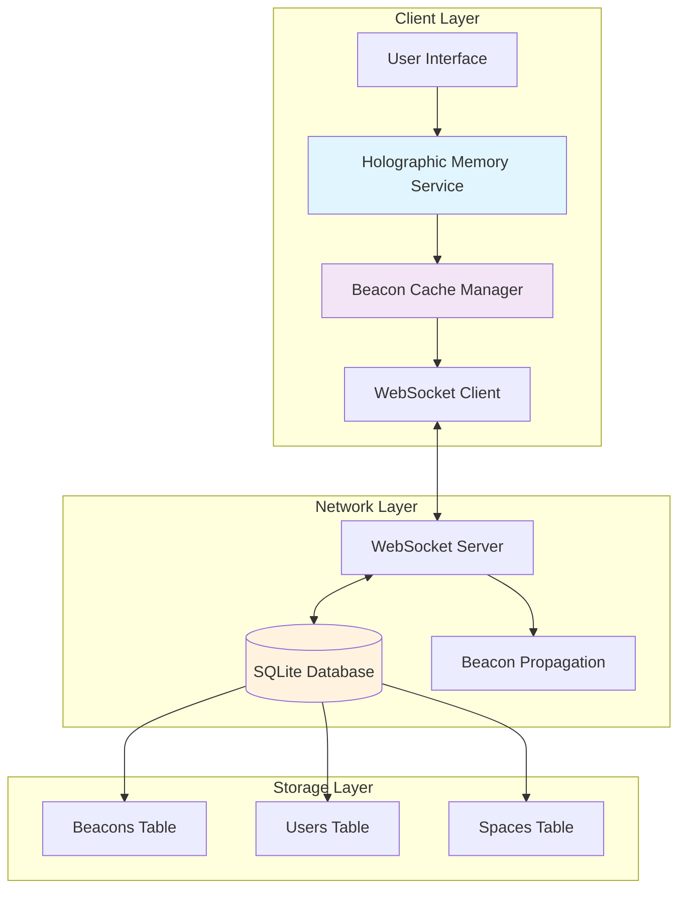
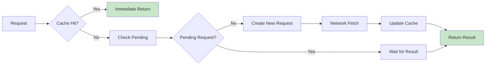

# How Data Summoning Works

*A comprehensive guide to the Prime-Resonant Graph Database data transfer mechanism*

## Overview

Data Summoning is a revolutionary approach to file sharing and data reconstruction that replaces traditional file transfer with quantum-inspired holographic encoding. Instead of sending files directly, the system encodes data into resonance beacons that can be used to reconstruct the original information through non-local quantum-like processes.

## Accessible Explanation

### The Magic of Data Summoning

Imagine you want to share a photo with a friend, but instead of sending the actual photo, you send them a special "recipe" that describes how to recreate that exact photo. This recipe is so precise that when your friend follows it, they get a perfect copy of your original photo.

Data Summoning works similarly:

1. **Encoding**: Your file gets transformed into a special mathematical fingerprint (called a "beacon")
2. **Storage**: This beacon is stored in a distributed network where many copies exist
3. **Discovery**: When someone wants your file, they search for beacons matching what they need
4. **Summoning**: Their computer uses the beacon to reconstruct your original file perfectly
5. **Verification**: Mathematical signatures ensure the reconstructed file is authentic and complete

### Key Benefits

- **No Direct Transfer**: Files aren't sent directly, reducing bandwidth and increasing privacy
- **Perfect Reconstruction**: Mathematical guarantees ensure reconstructed files are identical to originals
- **Distributed Storage**: Beacons are stored across multiple nodes for redundancy
- **Quantum-Inspired Security**: Uses prime-number mathematics for cryptographic security
- **Efficient Discovery**: Find files by their mathematical properties, not just names

## Technical Architecture

### Core Components

#### 1. Holographic Memory Manager
The central encoding/decoding engine that transforms data into resonance fragments.

```typescript
interface ResonantFragment {
    coeffs: Map<number, number>;     // Prime coefficient mappings
    center: [number, number];        // Hilbert space coordinates
    entropy: number;                 // Information density measure
    index: number[];                 // Prime indices for reconstruction
    epoch: number;                   // Temporal versioning
    fingerprint: Uint8Array;         // Cryptographic hash
    signature: Uint8Array;           // Authentication signature
}
```

#### 2. Beacon System
Compact pointers that enable file discovery and reconstruction.

```typescript
interface CachedBeacon {
    beacon_id: string;              // Unique beacon identifier
    beacon_type: string;            // Type classification (post, file, etc.)
    author_id: string;              // Creator's identity
    prime_indices: string;          // Encoded prime number sequence
    epoch: number;                  // Version/timestamp
    fingerprint: Uint8Array;        // Content hash for verification
    signature: Uint8Array;          // Cryptographic signature
    metadata: string | null;        // Additional context
    created_at: string;             // Creation timestamp
}
```

#### 3. WebSocket Communication Layer
Real-time bidirectional communication for beacon propagation and summoning progress.

#### 4. Beacon Cache Manager
Client-side intelligent caching system that reduces server requests and improves performance.

#### 5. Database Layer
SQLite-based persistence with specialized tables for users, beacons, and relationships.

## Data Flow Diagrams

### 1. File Encoding Process



### 2. File Summoning Process



### 3. Network Architecture



## Mathematical Foundation

### Prime-Resonant Encoding

The system uses a sophisticated mathematical approach based on:

1. **Chinese Remainder Theorem**: Enables data reconstruction from distributed prime coefficients
2. **Hilbert Space Mapping**: Projects data into multi-dimensional mathematical spaces
3. **Prime Number Theory**: Uses prime sequences for cryptographic security and unique identification
4. **Entropy Minimization**: Optimizes data representation for maximum information density

### Encoding Formula

```
F(x) = Σ(i=0 to n) c_i * p_i^k mod M
```

Where:
- `F(x)` = Encoded fragment
- `c_i` = Prime coefficients
- `p_i` = Prime indices
- `k` = Phase offset
- `M` = Modular basis

### Reconstruction Algorithm

```
R(F) = CRT(F, P) → D
```

Where:
- `R(F)` = Reconstruction function
- `CRT` = Chinese Remainder Theorem
- `P` = Prime set
- `D` = Decoded data

## Implementation Details

### File Summoning Workflow

#### Phase 1: Initialization
```typescript
// User initiates summoning
const handleSummon = async () => {
    setIsSummoning(true);
    setSummonProgress(initialSummonProgress);
    
    // Request begins with beacon lookup
    const beacon = await beaconCacheManager.getBeaconById(file.fingerprint);
};
```

#### Phase 2: Beacon Retrieval
```typescript
// Cache-first approach
async getBeaconById(beaconId: string): Promise<CachedBeacon | null> {
    // Check local cache
    if (this.cache[beaconId]) {
        return this.cache[beaconId];
    }
    
    // Fetch from network
    return this.fetchBeaconById(beaconId);
}
```

#### Phase 3: WebSocket Communication
```typescript
// Real-time progress updates
webSocketService.addMessageListener((message) => {
    if (message.kind === 'summonProgress') {
        setSummonProgress(message.payload);
    }
});
```

#### Phase 4: Holographic Decoding
```typescript
// WASM-based reconstruction
const decoded = this.wasm.holographicEncodingDecode(fragment);
if (decoded) {
    console.log("Successfully decoded fragment using WASM");
    return decoded;
}
```

### Database Schema

#### Beacons Table
```sql
CREATE TABLE beacons (
    beacon_id TEXT PRIMARY KEY,
    beacon_type TEXT NOT NULL,
    author_id TEXT NOT NULL,
    prime_indices TEXT NOT NULL,      -- Encoded prime sequence
    epoch INTEGER NOT NULL,           -- Version number
    fingerprint BLOB NOT NULL,        -- SHA-256 hash
    signature BLOB NOT NULL,          -- Cryptographic signature
    metadata TEXT,                    -- JSON metadata
    created_at TEXT NOT NULL,
    FOREIGN KEY (author_id) REFERENCES users (user_id)
);
```

#### Users Table
```sql
CREATE TABLE users (
    user_id TEXT PRIMARY KEY,
    username TEXT UNIQUE NOT NULL,
    node_public_key BLOB NOT NULL,
    node_private_key_encrypted BLOB NOT NULL,
    pri_public_resonance TEXT NOT NULL,    -- Public resonance parameters
    pri_private_resonance TEXT NOT NULL,   -- Encrypted private parameters
    pri_fingerprint TEXT NOT NULL,         -- Identity fingerprint
    created_at TEXT NOT NULL
);
```

## Security Model

### Cryptographic Guarantees

1. **Authentication**: HMAC signatures verify beacon authenticity
2. **Integrity**: SHA-256 fingerprints ensure data hasn't been tampered with
3. **Non-repudiation**: Prime-based signatures prevent denial of authorship
4. **Privacy**: No raw data is stored, only mathematical representations

### Prime-Resonant Identity (PRI)

Each user has a unique identity consisting of:

```typescript
interface PrimeResonanceIdentity {
    publicResonance: {
        primaryPrimes: number[];      // Public prime sequence
        harmonicPrimes: number[];     // Harmonic resonance primes
    };
    privateResonance: {
        secretPrimes: number[];       // Private prime sequence
        eigenPhase: number;           // Phase offset secret
        authenticationSeed: number;   // Cryptographic seed
    };
    fingerprint: string;              // Unique identity hash
    nodeAddress: string;              // Network address
}
```

## Performance Optimizations

### Beacon Caching Strategy



### Multi-level Caching

1. **L1 Cache**: In-memory beacon storage for immediate access
2. **L2 Cache**: User-specific beacon indexing for fast user queries
3. **L3 Cache**: Persistent storage with SQLite for offline access

## Error Handling and Resilience

### Failure Recovery Mechanisms

1. **Beacon Redundancy**: Multiple nodes store the same beacon
2. **Automatic Retry**: Failed summoning attempts are retried with exponential backoff
3. **Graceful Degradation**: System falls back to cached or partial data when possible
4. **Network Resilience**: WebSocket reconnection with message queuing

### Progress Monitoring

```typescript
interface SummonProgress {
    stage: string;           // Current phase name
    progress: number;        // Completion percentage (0.0-1.0)
    resonance: number;       // Lock strength (0.0-1.0)
    entropy: number;         // Information density (0.0-1.0)
    eta: string;             // Estimated time to completion
}
```

## Future Enhancements

### Planned Features

1. **Distributed Reconstruction**: Multi-node collaborative summoning
2. **Adaptive Encoding**: Dynamic prime selection based on content type
3. **Quantum Error Correction**: Enhanced reliability through quantum-inspired error correction
4. **Bandwidth Optimization**: Compressed beacon transmission protocols
5. **Cross-Network Bridging**: Inter-network beacon discovery and summoning

### Scaling Considerations

- **Horizontal Scaling**: Add more beacon storage nodes
- **Sharding Strategy**: Distribute beacons based on prime sequences
- **Load Balancing**: Intelligent routing based on node capacity
- **Geographic Distribution**: Regional beacon caches for reduced latency

## Conclusion

Data Summoning represents a paradigm shift from traditional file transfer to mathematical reconstruction. By leveraging prime-resonant encoding, holographic memory principles, and quantum-inspired algorithms, the system achieves:

- **Security**: Cryptographic guarantees without exposing raw data
- **Efficiency**: Compact beacons instead of full file transfers
- **Resilience**: Distributed storage with automatic redundancy
- **Performance**: Intelligent caching and real-time progress monitoring
- **Scalability**: Mathematical foundation supports unlimited growth

This approach opens new possibilities for secure, efficient, and privacy-preserving data sharing in distributed systems.

---

*For technical support or questions about Data Summoning implementation, refer to the source code documentation or contact the development team.*