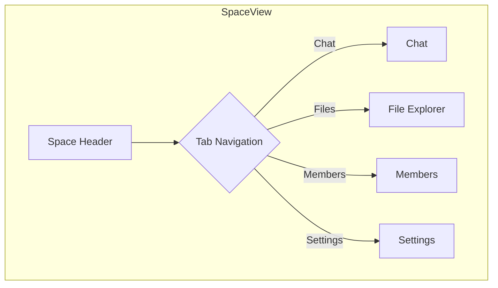

# Space File Sharing & Volume Architecture

This document outlines the design for extending Spaces to include file sharing capabilities, treating each space as a collective "Volume" of files contributed by its members.

## 1. Core Concepts

*   **Space as a Volume**: Every Space will now also function as a file volume. The collection of all files shared within a Space constitutes its Volume.
*   **Holographic File Beacons**: Each file will be represented by a `file_beacon`. This beacon will contain metadata about the file, including its cryptographic hash (fingerprint), name, size, type, and the uploader's identity. The actual file content will be handled by a separate distributed storage layer.
*   **Membership-Based Access**: Access to a Space's Volume is determined by membership in the Space. Only members can view, add, or (with permission) remove files.
*   **Quaternionic Synchronization**: File additions and removals will be synchronized across all members of a Space in real-time using the quaternionic communication channel we've established. This ensures instant updates for all participants.

## 2. Data Model & Schema Changes

### `files` Table

We will introduce a new table in our SQLite database to store file metadata.

```sql
CREATE TABLE IF NOT EXISTS files (
    file_id TEXT PRIMARY KEY,
    space_id TEXT NOT NULL,
    uploader_id TEXT NOT NULL,
    file_name TEXT NOT NULL,
    file_type TEXT NOT NULL,
    file_size INTEGER NOT NULL,
    fingerprint TEXT NOT NULL, -- Cryptographic hash of the file
    created_at TEXT NOT NULL,
    FOREIGN KEY (space_id) REFERENCES spaces (space_id),
    FOREIGN KEY (uploader_id) REFERENCES users (user_id)
);
```

### `beacons` Table

We will introduce a new `beacon_type` enum value: `file_beacon`.

## 3. Backend Architecture

### `SpaceManager` (`server/spaces.ts`)

The `SpaceManager` will be extended to handle file operations within a space.

```typescript
// in server/spaces.ts

export class SpaceManager {
    // ... existing methods

    async addFileToBeacon(spaceId: string, uploaderId: string, fileInfo: { fileName: string, fileType: string, fileSize: number, fingerprint: string }): Promise<{ fileId: string }> {
        // ... implementation to create a new file record in the 'files' table
        // ... and then create a 'file_beacon' to announce the new file.
    }

    async removeFileFromBeacon(spaceId: string, removerId: string, fileId: string): Promise<void> {
        // ... implementation to verify permissions and remove the file record.
        // ... A new beacon could be broadcast to signal the removal.
    }

    async getSpaceFiles(spaceId: string): Promise<any[]> {
        // ... implementation to retrieve all files associated with a space.
    }
}
```

### WebSocket Protocol (`server/protocol.ts`)

We'll add new message kinds for file operations:

```typescript
// Client -> Server
export interface AddFileMessage {
    kind: 'addFileToSpace';
    payload: {
        spaceId: string;
        fileName: string;
        fileType: string;
        fileSize: number;
        fingerprint: string;
    };
}

export interface RemoveFileMessage {
    kind: 'removeFileFromSpace';
    payload: {
        spaceId: string;
        fileId: string;
    };
}

export interface GetSpaceFilesMessage {
    kind: 'getSpaceFiles';
    payload: {
        spaceId: string;
    };
}


// Server -> Client
export interface SpaceFilesResponseMessage {
    kind: 'spaceFilesResponse';
    payload: {
        spaceId: string;
        files: any[];
    };
}

export interface FileAddedToSpaceMessage {
    kind: 'fileAddedToSpace';
    payload: {
        spaceId: string;
        file: any;
    };
}

export interface FileRemovedFromSpaceMessage {
    kind: 'fileRemovedFromSpace';
    payload: {
        spaceId: string;
        fileId: string;
    };
}
```

## 4. Frontend Design

### `SpaceView` Component (`src/components/SpaceView.tsx`)

The `SpaceView` will be redesigned to include a dedicated file management section.



### File Explorer UI

The "Files" tab within a `SpaceView` will feature a rich file explorer interface:

*   **File Grid/List View**: Toggle between a visual grid of file cards and a detailed list view.
*   **File Upload**: A drag-and-drop zone for uploading new files.
*   **File Actions**: Context menu on each file for downloading, viewing details, or removing (with permission).
*   **Toolbar**: Controls for sorting (by name, date, size, type), searching, and changing the view.
*   **Real-time Updates**: The file list will update in real-time as members add or remove files, powered by our quaternionic WebSocket channel.

### New Components

We'll create a suite of new components for this feature under `src/components/common/files/`:

*   `FileExplorer.tsx`: The main container for the file management UI.
*   `FileGrid.tsx` & `FileList.tsx`: The two different view modes.
*   `FileCard.tsx`: A card representing a single file in the grid view.
*   `FileListRow.tsx`: A row representing a single file in the list view.
*   `FileUploadZone.tsx`: The drag-and-drop upload area.
*   `FileDetailsModal.tsx`: A modal to show detailed information about a file.

## 5. User Flow

1.  A user navigates to a Space.
2.  They click on the "Files" tab.
3.  The `FileExplorer` component mounts and sends a `getSpaceFiles` message to the server.
4.  The server responds with a `spaceFilesResponse`, and the UI populates with the list of files.
5.  The user drags a new file into the `FileUploadZone`.
6.  The frontend calculates the file's hash (fingerprint) and sends an `addFileToSpace` message to the server.
7.  The server creates the file record and broadcasts a `fileAddedToSpace` message to all members of the space.
8.  All connected members see the new file appear in their `FileExplorer` in real-time.

This design provides a robust, real-time, and secure file sharing system within Spaces, leveraging our existing quaternionic communication infrastructure for a seamless user experience.
